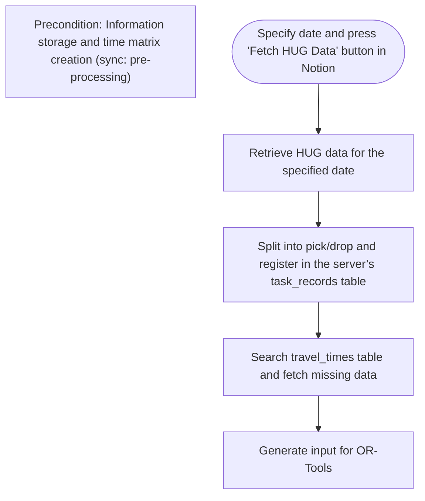
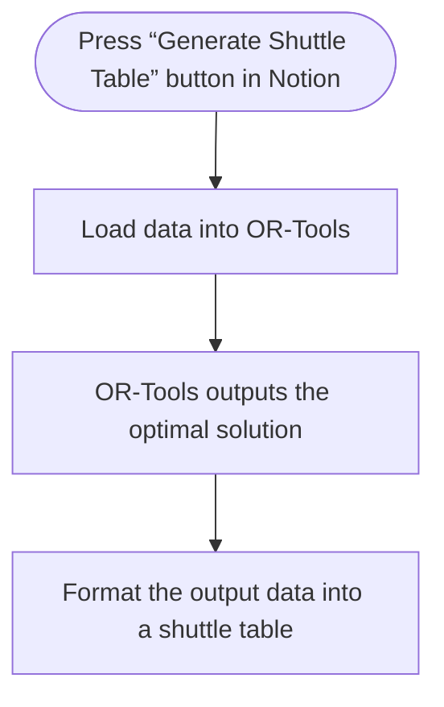
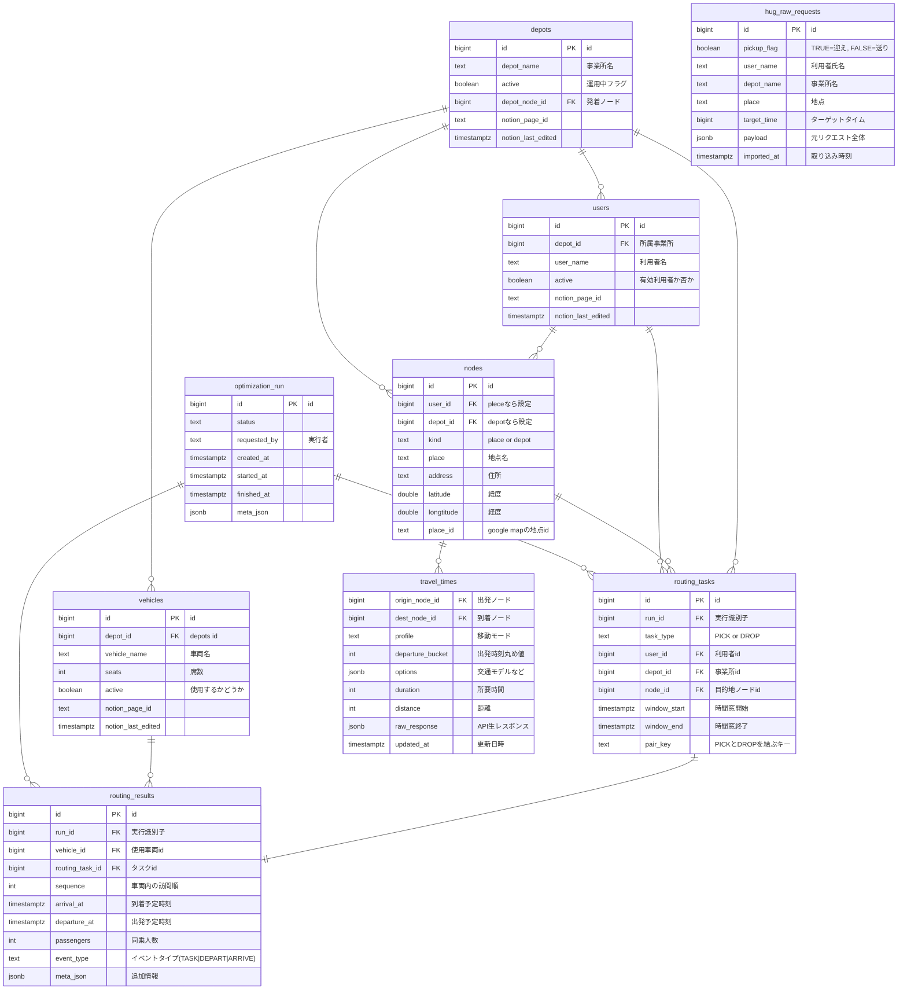

# Shuttle Table Implementation Instructions:
## Background and Objective
- Extract data from HUG and create a pickup and drop-off schedule (送迎表).

### Used Services:
1. HUG
    - Data source for shuttle tasks.
    - https://www.hug-gioire.link/hug/wm/
    - External system that manages user information.

2. Google OR-Tools
    - Optimization engine used to solve the Traveling Salesman Problem.
    - https://developers.google.com/optimization

3. Google Maps API
    - Used to create the time table (time matrix) input for OR-Tools.
    - https://developers.google.com/maps

4. Playwright
    - Used to extract data from HUG.
    - https://zenn.dev/muit_techblog/articles/e355268058acb7
    - codegen: Records browser operations and automatically generates executable code.
        - https://zenn.dev/zenn24yykiitos/articles/3d7f582ac119b5

### Trigger Conditions
- Buttons placed on the following Notion page act as triggers:
    - One button triggers the process to fetch data from HUG.
    - Another triggers the process to generate the shuttle table using the fetched data.

## Process Overview (Main Process):
- Step 1 (Pre-Processing)
Information storage and time matrix preparation.
    - Syncing data before processing (sync: pre-processing).
- Step 2
    - Select a specific day on Notion and press the HUG data fetch button to retrieve the data from HUG.
- Step 3
    - Split the fetched data into "pick" and "drop" tasks, then store them in the task records database.
- Step 4
    - Search for travel times and retrieve any missing data.
- Step 5
    - Prepare the input data for OR-Tools.


## From Data Retrieval to Shuttle Table Generation:
- Step A
    - Press the schedule creation button on Notion.
- Step B
    - The data is then fed into OR-Tools for processing.
- Step C
    - OR-Tools generates a solution.
- Step D
    - Retrieve the generated data and format it into the schedule.


## Database Structure:
### 1. depots (Facility Master)
#### Purpose:
Manage information about facilities/offices. Acts as a parent for vehicles, users, and nodes.
#### Source:
Notion (Facility List DB)
| Column               | Type                   | NULL | Description                            |
| -------------------- | ---------------------- | ---- | -------------------------------------- |
| `id`                 | bigint (PK)            | NO   | Internal ID                            |
| `depot_name`         | text                   | NO   | Facility name (unique recommended)     |
| `active`             | boolean                | NO   | Active flag (0 = inactive, 1 = active) |
| `depot_node_id`      | bigint (FK → nodes.id) | NO   | The “start/end node” of the facility   |
| `notion_page_id`     | timestamp              | YES  | For Notion sync                        |
| `notion_last_edited` | timestamp              | YES  | For Notion sync                        |
#### Usage:
- Edited and synced from Notion.
- Referenced by vehicles and users.
- Used by OR-Tools to determine each vehicle’s start/end node.

### 2. vehicles (Vehicle Master)
#### Purpose:
Define the set of vehicles used for optimization.
#### Source:
Notion (Vehicle List DB)
| Column               | Type                    | NULL | Description                                   |
| -------------------- | ----------------------- | ---- | --------------------------------------------- |
| `id`                 | bigint (PK)             | NO   | Vehicle ID                                    |
| `depot_id`           | bigint (FK → depots.id) | NO   | Affiliated facility                           |
| `vehicle_name`       | text                    | NO   | Vehicle name                                  |
| `seats`              | int                     | NO   | Number of seats (used as OR-Tools “capacity”) |
| `active`             | boolean                 | NO   | Only active vehicles are used                 |
| `notion_page_id`     | timestamp               | YES  | For Notion sync                               |
| `notion_last_edited` | timestamp               | YES  | For Notion sync                               |
#### Usage:
- Used as the “vehicle set” input for OR-Tools (seats = capacity).

### 3. users (User Master)
#### Purpose:
Manage users who are transported by the shuttle.
#### Source:
Notion (User List DB)
| Column               | Type                    | NULL | Description                            |
| -------------------- | ----------------------- | ---- | -------------------------------------- |
| `id`                 | bigint (PK)             | NO   | User ID                                |
| `depot_id`           | bigint (FK → depots.id) | NO   | Affiliated facility                    |
| `user_name`          | text                    | NO   | User’s name                            |
| `active`             | boolean                 | NO   | Active flag (0 = inactive, 1 = active) |
| `notion_page_id`     | timestamptz             | YES  | For Notion sync                        |
| `notion_last_edited` | timestamp               | YES  | For Notion sync                        |
#### Usage:
- Relation users : nodes = 1 : many.
- Used to match user info when generating tasks from raw requests.

### 4. nodes (Location Nodes)
#### Purpose:
Centralized management of physical locations (addresses and coordinates).
#### Source:
Notion (Location Node List DB)
| Column      | Type        | NULL | Description                              |
| ----------- | ----------- | ---- | ---------------------------------------- |
| `id`        | bigint (PK) | NO   | Node ID                                  |
| `user_id`   | bigint (FK) | YES  | Set if user-related                      |
| `depot_id`  | bigint (FK) | YES  | Set if facility-related                  |
| `kind`      | text        | NO   | `'place'` or `'depot'`                   |
| `place`     | text        | NO   | Location name (e.g., “Home”, “Center A”) |
| `address`   | text        | NO   | Address                                  |
| `latitude`  | double      | YES  | Latitude                                 |
| `longitude` | double      | YES  | Longitude                                |
| `place_id`  | text        | YES  | Google Maps place ID                     |
#### Usage:
- Referenced by depots.depot_node_id
- Referenced by routing_tasks.node_id
- Key pair for travel_times
- When updating via the Route Matrix API, also fill in place_id, latitude, and longitude.

### 5. travel_times (Travel Time Cache)
#### Purpose:
Store travel durations and distances between node pairs (results of the Google Route Matrix API).
| Column             | Type      | NULL | Description                                   |
| ------------------ | --------- | ---- | --------------------------------------------- |
| `origin_node_id`   | bigint    | NO   | Start node                                    |
| `dest_node_id`     | bigint    | NO   | Destination node                              |
| `profile`          | text      | NO   | Travel mode (e.g., “driving”)                 |
| `departure_bucket` | int       | NO   | Rounded departure time (e.g., 60-minute unit) |
| `options`          | jsonb     | NO   | Traffic model or options                      |
| `duration`         | int       | NO   | Travel duration (seconds)                     |
| `distance`         | int       | NO   | Distance (meters)                             |
| `raw_response`     | jsonb     | YES  | Raw API response                              |
| `updated_at`       | timestamp | NO   | Last updated                                  |
#### Usage:
- Used to create the OR-Tools cost matrix (time_matrix).
- If not cached, call the API and UPSERT.
- For example: for a 19:30 departure, use cache with 19:00 time bucket.

### 6. hug_raw_requests (Input Data: Pickup/Drop-off)
#### Purpose:
Temporary staging for each shuttle request.
#### Source:
Slack form or other external inputs.
| Column        | Type        | NULL | Description                     |
| ------------- | ----------- | ---- | ------------------------------- |
| `id`          | bigint (PK) | NO   | Request ID                      |
| `pickup_flag` | boolean     | NO   | TRUE = pickup, FALSE = drop-off |
| `user_name`   | text        | NO   | User name                       |
| `depot_name`  | text        | NO   | Facility name                   |
| `place`       | text        | NO   | Location name                   |
| `target_time` | bigint      | NO   | Time (epoch seconds)            |
| `imported_at` | timestamp   | YES  | Time imported                   |
#### Usage:
- Split into two rows (PICK and DROP) to generate task_record.

### 7. optimization_run (Execution Metadata)
#### Purpose:
Identify each optimization run and manage its status.
| Column         | Type        | NULL | Description                                  |
| -------------- | ----------- | ---- | -------------------------------------------- |
| `id`           | bigint (PK) | NO   | Run ID                                       |
| `status`       | text        | NO   | ‘pending’, ‘running’, ‘success’, or ‘failed’ |
| `requested_by` | text        | YES  | Executor name                                |
| `created_at`   | timestamp   | NO   | Created timestamp                            |
| `started_at`   | timestamp   | NO   | Start time                                   |
| `finished_at`  | timestamp   | NO   | End time                                     |
| `meta_json`    | jsonb       | YES  | Metadata (conditions, etc.)                  |
#### Usage:
- Parent key for routing_tasks and routing_results
- Keeps history of optimization runs

### 8. routing_tasks (OR-Tools Input Tasks)
#### Purpose:
Store all PICK/DROP tasks belonging to one run.
| Column         | Type                              | NULL | Description               |
| -------------- | --------------------------------- | ---- | ------------------------- |
| `id`           | bigint (PK)                       | NO   | Task ID                   |
| `run_id`       | bigint (FK → optimization_run.id) | NO   | Run ID                    |
| `task_type`    | text                              | NO   | ‘PICK’ or ‘DROP’          |
| `user_id`      | bigint                            | NO   | Related user              |
| `depot_id`     | bigint                            | NO   | Facility                  |
| `node_id`      | bigint                            | NO   | Node destination          |
| `window_start` | timestamp                         | NO   | Start of time window      |
| `window_end`   | timestamp                         | NO   | End of time window        |
| `pair_key`     | text                              | NO   | Key linking PICK and DROP |

### 9. routing_results (Optimization Output)
#### Purpose:
Store route results output from OR-Tools.
| Column            | Type                              | NULL | Description                                        |
| ----------------- | --------------------------------- | ---- | -------------------------------------------------- |
| `id`              | bigint (PK)                       | NO   | Row ID                                             |
| `run_id`          | bigint (FK → optimization_run.id) | NO   | Run ID                                             |
| `vehicle_id`      | bigint (FK → vehicles.id)         | NO   | Vehicle used                                       |
| `routing_task_id` | bigint (FK → routing_tasks.id)    | YES  | Related task                                       |
| `sequence`        | int                               | NO   | Visit order within the vehicle                     |
| `arrival_at`      | timestamptz                       | NO   | Estimated arrival time                             |
| `departure_at`    | timestamptz                       | NO   | Estimated departure time                           |
| `passengers`      | int                               | NO   | Passenger count                                    |
| `event_type`      | text                              | NO   | Event type (‘TASK’, ‘DEPART’, or ‘ARRIVE’)         |
| `meta_json`       | jsonb                             | YES  | Additional information (distance, wait time, etc.) |
#### Usage:
- Used to determine if an event is PICK/DROP, departure, or arrival.

## Implementation Steps:
### Goal
Build all necessary database tables.
| Table                                      | In Notion | In Server |
| ------------------------------------------ | --------- | --------- |
| User List (`users`)                        | ✅         | ✅         |
| Vehicle List (`vehicles`)                  | ✅         | ✅         |
| Facility List (`depots`)                   | ✅         | ✅         |
| Location Node List (`nodes`)               | ✅         | ✅         |
| Travel Time Matrix (`travel_times`)        | ❌         | ✅         |
| Task List (`task_record`)                  | ❌         | ✅         |
| Raw Tasks (`hug_raw_request`)              | ❌         | ✅         |
| Optimization Run Meta (`optimization_run`) | ❌         | ✅         |
| Optimization Results (`routing_result`)    | ❌         | ✅         |

1. Create the Database and Sync Process:
    - Set up PostgreSQL on a Windows server.
    - Create necessary tables in the database to match the Notion databases.
    - Ensure synchronization between Notion data and server data.
2. Create the Time Matrix:
    - Use Google Routes API to create the time matrix based on the nodes data.
    - Cache the results into the travel_times table.
3. Fetch Data from HUG:
    - Implement a button to trigger the fetch of data from HUG and save it into the hug_raw_request table.
    - Extract information such as user names, locations, and requested times.
4. Convert the Extracted Tasks into PICK/DROP Tasks:
    - Check the pickup_flag and split the tasks into pick and drop entries in the task_record table.
    - Adjust the time windows for each task.
5. Generate Time Matrix for Selected Nodes:
    - For the tasks in task_record, extract the relevant nodes and build a time matrix.
6. Send Data to OR-Tools:
    - Extract necessary data from the database (optimization run, tasks, travel times, vehicles, depots).
    - Format the data and send it to OR-Tools via API.
7. Generate the Pickup and Drop-Off Schedule from OR-Tools Output:
    - Once the solution is generated, store it in the routing_result table.
    - Format the results into a schedule and output it in a spreadsheet.

### Process Details
1. Build the database as shown in the table above.
    - Set up PostgreSQL 16/17 on the Windows server.
        - Install PostgreSQL 16/17.
        - Configure psql access.
        - Create a dedicated database and roles for the application.

#### Example SQL Setup
```sql
-- 1. Create database
CREATE DATABASE ops_routing
  WITH ENCODING 'UTF8'
       LC_COLLATE 'C'
       LC_CTYPE 'C'
       TEMPLATE template0;

\c ops_routing
ALTER DATABASE ops_routing SET timezone TO 'Asia/Tokyo';

-- 2. Schemas
CREATE SCHEMA IF NOT EXISTS core;
CREATE SCHEMA IF NOT EXISTS run;
CREATE SCHEMA IF NOT EXISTS stg;

-- 3. Roles
CREATE ROLE app_rw LOGIN PASSWORD 'change_me_rw';
CREATE ROLE app_ro LOGIN PASSWORD 'change_me_ro';
CREATE ROLE etl LOGIN PASSWORD 'change_me_etl';
```

#### Schema and Permissions
```sql
GRANT USAGE ON SCHEMA core, run, stg TO app_ro, app_rw, etl;
ALTER DEFAULT PRIVILEGES IN SCHEMA core GRANT SELECT ON TABLES TO app_ro;
ALTER DEFAULT PRIVILEGES IN SCHEMA core GRANT SELECT,INSERT,UPDATE,DELETE ON TABLES TO app_rw, etl;
```

### Core Tables (Summary)
- core.depots
- core.users
- core.nodes
- core.vehicles
- core.travel_times
- stg.hug_raw_request
- run.optimization_run
- run.task_record
- run.routing_result

### 2. Create Time Matrix
#### Goal
Generate travel time matrices using the Google Routes API – Compute Route Matrix.
#### Process
1. Use nodes.address data as the base to request travel times for each hour block.
2. Save results to travel_times using (origin_node_id, dest_node_id, profile, departure_bucket) as keys.
3. Store API results and metadata such as distance and duration.
4. Also update nodes.latitude, nodes.longitude, and place_id with data returned from the API.
#### Example Data:
| origin_node_id | dest_node_id | profile | departure_bucket | duration | distance |
| -------------- | ------------ | ------- | ---------------- | -------- | -------- |
| 0              | 1            | driving | 1760991600       | 480      | 4820     |
| 1              | 0            | driving | 1760991600       | 510      | 4800     |
| 0              | 2            | driving | 1760991600       | 540      | 5420     |
| 2              | 0            | driving | 1760991600       | 555      | 5450     |
#### Todo
- Generate time matrix from nodes.
- Cache data into travel_times.

### 3. Fetch Data from HUG (Playwright)
#### Goal
Use Playwright to fetch shuttle task data from HUG and save it into hug_raw_request.
#### Process
1. Press the “Fetch HUG Data” button in Notion.
2. The script logs in to HUG, navigates to “今日の送迎 (Today’s Shuttle)”, and retrieves shuttle management data.
#### Data mapping:
| HUG Display            | Database Column |
| ---------------------- | --------------- |
| お迎え希望時間 (Pickup Time)  | target_time     |
| 児童名 (Child Name)       | user_name       |
| 施設名 (Facility Name)    | depot_name      |
| 場所 (Location)          | place           |
| 迎え or 送り (Pickup/Drop) | pickup_flag     |
#### Todo
- Connect Notion webhook to Playwright RPA.
- Save extracted data to database.

### 4. Convert Extracted Tasks to PICK/DROP Records
#### Goal
Convert hug_raw_request records into task_record entries for each PICK and DROP task.
#### Process
1. Check each pickup_flag:
    - If TRUE (Pickup):
        - place → PICK node, depot → DROP node.
        - Set pickup window ±10 minutes around target_time.
        - Set drop window as travel_time + 30-minute margin.
    - If FALSE (Drop):
        - depot → PICK node, place → DROP node.
        - Set drop window: -10 to +60 minutes from target_time.
### Todo
    - Generate tasks from stored information.
    - Distribute info across each task.

### 5. Extract Time Matrix for Selected Nodes
#### Goal
Generate a time matrix only for nodes appearing in the current day’s task_record set.
#### Process
1. Press the “Generate Shuttle Table” button in Notion.
2. Search travel_times for nodes matching task_record entries.
3. If missing, call the Route Matrix API again and update the cache.
#### Example
| origin_node_id | dest_node_id | duration | distance |
| -------------- | ------------ | -------- | -------- |
| 0              | 1            | 480      | 4820     |
| 1              | 0            | 480      | 4820     |
| 0              | 2            | 540      | 5420     |
#### Resulting Matrix Example
```python
time_matrix = [
  [ 0, 480, 540 ],
  [ 480, 0, 120 ],
  [ 540, 120, 0 ],
]
```
#### Todo
- Extract cached data from travel_times.
- Generate new Route Matrix requests when missing.

### 6. Compile Data and Send to OR-Tools
#### Goal
Combine all relevant database data and send as a request to the OR-Tools API.
#### Process
1. Collect data from:
    - optimization_run
    - task_record
    - travel_times
    - vehicles
    - depots
2. Format as OR-Tools input JSON:
    - Include vehicle capacity (seats).
    - Minimize number of vehicles.
    - Define start and end at depot.
#### Todo
- Aggregate data for OR-Tools.
- Format payload.
- Send API request.

### 7. Format OR-Tools Output into Shuttle Table
#### Goal
Format OR-Tools results into an organized Google Spreadsheet table.
#### Process
1. Save OR-Tools output to routing_result.
    - Include DEPART and ARRIVE records for depots.
2. Format the results to match the official Gioire shuttle spreadsheet layout:
https://docs.google.com/spreadsheets/d/18RCcxilfI6UpqpPel7EUOjW33iaznQ0WWN07xN9x0jE/edit#gid=1498190989
#### Mapping Example:
| Field        | Sheet Location | Data Source                                                           |
| ------------ | -------------- | --------------------------------------------------------------------- |
| Vehicle Name | C1             | `vehicles.vehicle_name`                                               |
| Capacity     | E1             | `vehicles.seats`                                                      |
| Time         | A-column       | `routing_results.arrival_at`                                          |
| Task         | B-column       | If `TASK` → task type; if `DEPART` → “Depart”; if `ARRIVE` → “Arrive” |
| User Name    | C-column       | `users.user_name`                                                     |
| Location     | D-column       | `nodes.place`                                                         |
| Address      | E-column       | `nodes.address`                                                       |
| Passengers   | F-column       | `routing_results.passengers`                                          |
#### Formatting Rule
- Tables are created per vehicle.
- If three vehicles are used, they appear starting at columns A, H, and O.
#### Todo
- Save output to database.
- Format and output to Google Spreadsheet.

## Testing Cases:
| No | Type | Target                            | Test Focus                                    | Input/Condition             | Procedure                  | Expected Result                             |
| -- | ---- | --------------------------------- | --------------------------------------------- | --------------------------- | -------------------------- | ------------------------------------------- |
| 1  | Unit | Time rounding                     | Verify JST→UTC conversion and hourly rounding | Input: 2025-10-21 08:05 JST | Compute `departure_bucket` | Correct floor value; boundary cases checked |
| 2  | Unit | HUG import → `hug_raw_requests`   | Schema compliance                             | Import 3 test records       | Run import function        | Fields stored correctly                     |
| 3  | Unit | Task conversion → `routing_tasks` | Correct PICK/DROP generation and pairing      | Input 1 record              | Execute conversion         | Properly paired tasks created               |
| 4  | Unit | `travel_times` search             | HIT/MISS detection                            | Half cached, half missing   | Execute search             | Returns cache hits, marks misses            |
| 6  | Unit | Matrix cache update               | Normalization of values                       | Insert 6 elements           | Execute caching            | Correctly inserted or updated               |

## Integration Tests
| No | Type        | Scenario                                | Test Focus                        | Condition                 | Procedure            | Expected Result                    |
| -- | ----------- | --------------------------------------- | --------------------------------- | ------------------------- | -------------------- | ---------------------------------- |
| 8  | Integration | HUG import → Task conversion            | End-to-end check                  | Mixed pickup/drop dataset | Run full process     | All tasks stored                   |
| 9  | Integration | `routing_tasks` → `travel_times` lookup | Cache HIT/MISS flow               | Partial cache             | Rebuild and upsert   | All pairs available                |
| 10 | Integration | `travel_times` → OR-Tools               | Matrix correctness                | 3 nodes cached            | Run optimization     | Valid asymmetric matrix            |
| 11 | Integration | OR-Tools output → `routing_results`     | Output sequence/order correctness | From No.10 result         | Validate event types | Proper sequence and timestamps     |
| 12 | Integration | `routing_results` → Spreadsheet         | Output structure verification     | From No.11 result         | Export to sheet      | Matches expected format            |
| 13 | Integration | Full run → `optimization_run`           | End-to-end summary                | Normal case               | Run full pipeline    | Execution info stored successfully |

## Development Phases:
- Phase 1: Build DB + Notion sync
- Phase 2: Build time matrix via Google Routes API
- Phase 3: Extract data from HUG via Playwright
- Phase 4: Split pickup/drop and create tasks
- Phase 5: Build filtered time matrix for selected nodes
- Phase 6: Feed data into OR-Tools and execute optimization
- Phase 7: Format OR-Tools output into shuttle spreadsheet and save results**

## ER Diagram:

